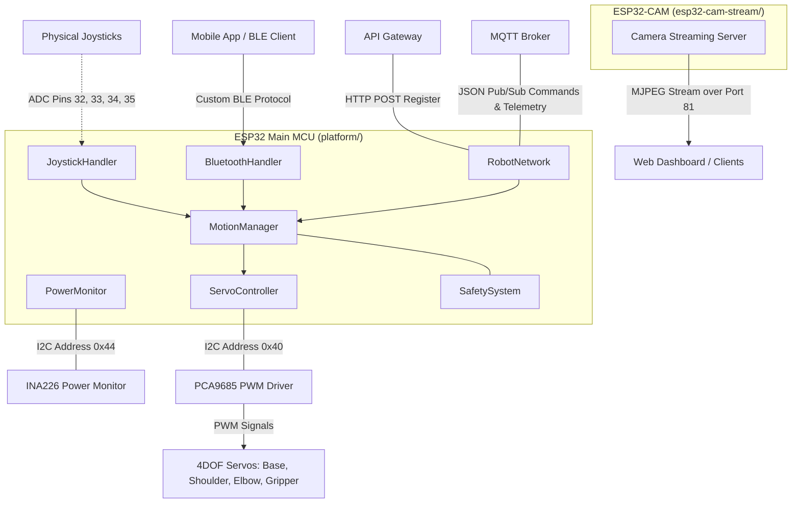

# 🤖 Grabber Firmware (v1.0.0)

> **Repository `02`** · Dual-firmware ecosystem for the Grabber 4DOF robotic arm. Features real-time PCA9685 I²C servo control, BLE command interface, INA226 power monitoring, dynamic API registration, MQTT pub/sub telemetry, and a dedicated ESP32-CAM MJPEG video streaming server.

[]()
[]()
[]()
[]()
[]()


## 🎥 Video Demonstration

<div align="center">
  <a href="https://youtu.be/s2zgFPOAeLU?si=avPE3SV8oZcvlSe6">
    
  </a>
  <br/>
  <sub>Click the image above to watch the demonstration video on YouTube.</sub>
</div>

---


## 🧭 System Architecture

The firmware is split into two independent projects running on separate ESP32 chips:
1. **`platform/`**: The main robotic arm controller handling motion, safety, connectivity, and power metrics.
2. **`esp32-cam-stream/`**: A dedicated video streaming server running on an ESP32-CAM to provide low-latency MJPEG video feedback.



---

## 📦 Firmware Structure

```
02-grabber-firmware/
├── platform/                          ← Main ESP32 Controller Project
│   ├── platform.ino                   ← Entry point, initialization, and main execution loop
│   ├── include/
│   │   └── Config.h                   ← Global parameters, pins, safety bounds, and defaults
│   └── src/
│       └── modules/
│           ├── servo_control/         ← PCA9685 interface (angle-to-pulse mapping)
│           ├── motion/                ← Smooth exponential filtering interpolation & sequence targets
│           ├── safety/                ← Soft safety decelerations near mechanical limit zones
│           ├── power/                 ← INA226 bus statistics, energy Wh, and capacity prediction
│           ├── joystick/              ← Deadzone filtering and quadratic stick curve processing
│           ├── bluetooth/             ← BLE GATT server for local command control
│           └── network/               ← WiFiManager config, HTTP API registration, and MQTT client
│
└── esp32-cam-stream/                  ← ESP32-CAM Independent Project
    ├── esp32-cam-stream.ino           ← Camera configurations & WiFi initialization
    ├── camera_pins.h                  ← Pinout selection for AI-Thinker module
    └── app_httpd.cpp                  ← Low-latency CORS-enabled MJPEG stream handler
```

> [!NOTE]
> The source directories `ota/`, `camera/`, and `mqtt_client/` inside the main platform folder are currently empty structure placeholders. Their respective functionalities are handled by the integrated `RobotNetwork` module and the separate `esp32-cam-stream` package.

---

## 🔌 Hardware Wiring & Address Allocation

### Microcontrollers
* **Main Compute**: ESP32 Development Board (e.g., ESP32-WROOM-32D).
* **Vision Feed**: ESP32-CAM (AI-Thinker model with PSRAM).

### I²C Bus Pinout (Main MCU)
* **SDA**: GPIO 21
* **SCL**: GPIO 22
* **I²C Clock**: 100 kHz (`Wire.setClock(100000)`)

| Device | I²C Address | Role | Notes |
|---|---|---|---|
| **PCA9685** | `0x40` | 16-Channel PWM Servo Driver | Configured for 50Hz analog servos. |
| **INA226** | `0x44` | High-Side Power & Current Monitor | Solder the **A0** pad on the breakout board to set address `0x44` (prevents conflict with PCA9685 at `0x40`). Uses a `0.1Ω` shunt resistor. |

### PWM Servo Channels (PCA9685)
* **Channel 0**: J1 — Base Rotation (`MG996R`)
* **Channel 1**: J2 — Shoulder Joint (`MG996R`)
* **Channel 2**: J3 — Elbow Joint (`MG90S` / `SG90`)
* **Channel 3**: J4 — Gripper (`SG90`)

### Analog Joystick Pins (Main MCU)
Joystick processing is compiled only if `USE_JOYSTICK` is defined as `true` in `Config.h`.
* **Base (J1)**: GPIO 32 (`JOY1_X`)
* **Shoulder (J2)**: GPIO 33 (`JOY1_Y`)
* **Elbow (J3)**: GPIO 34 (`JOY2_X`)
* **Gripper (J4)**: GPIO 35 (`JOY2_Y`)

---

## 📡 Connectivity Protocols

### 1. HTTP API Registration
On startup, if WiFi is successfully connected, the Main ESP32 issues a registration request to the API Gateway:
* **Endpoint**: `POST http://192.168.1.103:8000/api/v1/robots/register`
* **Content-Type**: `application/json`
* **Payload Structure**:
  ```json
  {
    "robot_id": "GRABBER-V1-ESP32",
    "serial_key": "1234-5678-9012-3456",
    "name": "Grabber Arm 1",
    "model": "ESP32-PCA9685",
    "firmware_version": "1.0.0"
  }
  ```

### 2. MQTT Telemetry & Controls
The client automatically reconnects, keeps connection alive with an LWT (Last Will and Testament), and schedules telemetry publications.

#### Subscribes (Commands IN)
* **`robot/GRABBER-V1-ESP32/commands/move`**: Move a single servo to a specific target angle.
  ```json
  {
    "servo": 0, 
    "angle": 90.0
  }
  ```
* **`robot/GRABBER-V1-ESP32/commands/execute-pose`**: Set target angles for all joints simultaneously.
  ```json
  {
    "j1": 90.0,
    "j2": 100.0,
    "j3": 60.0,
    "j4": 90.0
  }
  ```
* **`robot/GRABBER-V1-ESP32/commands/estop`**: Immediately halt all motion (locks transition state to `EMERGENCY_STOP`).
* **`robot/GRABBER-V1-ESP32/commands/clear_estop`**: Release emergency stop lock, returning state to `IDLE`.
* **`robot/GRABBER-V1-ESP32/commands/home`**: Return all joint targets to their pre-configured home angles.
* **`robot/GRABBER-V1-ESP32/commands/open-gripper`**: Command the gripper to open (`GRIPPER_MAX`).
* **`robot/GRABBER-V1-ESP32/commands/close-gripper`**: Command the gripper to close (`GRIPPER_MIN`).

#### Publishes (Telemetry OUT)
* **`robot/GRABBER-V1-ESP32/status`** *(Retained, LWT)*: Published on state transitions or on connection failures.
  ```json
  {"state": "IDLE"} // Options: OFFLINE, IDLE, MOVING, EXECUTING, ERROR, EMERGENCY_STOP
  ```
* **`robot/GRABBER-V1-ESP32/heartbeat`** *(Every 5 seconds)*:
  ```json
  {
    "robotId": "GRABBER-V1-ESP32",
    "timestamp": 0,
    "state": "IDLE",
    "firmware": "1.0.0"
  }
  ```
* **`robot/GRABBER-V1-ESP32/telemetry`** *(Every 1 second)*:
  ```json
  {
    "robotId": "GRABBER-V1-ESP32",
    "timestamp": 0,
    "angles": {
      "base": 90.0,
      "shoulder": 100.0,
      "elbow": 60.0,
      "grip": 90.0
    },
    "power": {
      "voltage": 7.42,
      "current": 182.5,
      "power": 1354.2,
      "peakCurrent": 412.0,
      "idleCurrent": 120.5,
      "movingCurrent": 245.1,
      "energyWh": 0.043,
      "remainingCapacity": 78.5,
      "runtimeMins": 465.2
    }
  }
  ```
* **`robot/GRABBER-V1-ESP32/errors`**: Published with specific code payload on system malfunctions.
  ```json
  {
    "state": "ERROR",
    "errorCode": "ERR_I2C_TIMEOUT"
  }
  ```

### 3. Bluetooth BLE Protocol
Enables wireless local control via standard BLE GATT communication.
* **Device Broadcast Name**: `Grabber_BLE`
* **Service UUID**: `4fafc201-1fb5-459e-8fcc-c5c9c331914b`
* **Characteristic UUID**: `beb5483e-36e1-4688-b7f5-ea07361b26a8` (Read, Write, Notify)
* **Accepted Formats**:
  * **Single Joint Control**: `J:<servo_index>:<angle>\n` (e.g., `J:0:90` maps Base to 90°)
  * **Multi Joint Coordinate Control**: `A:<a0>:<a1>:<a2>:<a3>\n` (e.g., `A:90.0:100.0:60.0:90.0`)

---

## 🛡️ Safety & Motion Control Systems

### Smooth Interpolation
To protect mechanical gearboxes from instantaneous torque spikes, target coordinates are not applied directly. The `MotionManager` implements a smooth exponential filter in its 15ms loop:

```cpp
currentAngle += (targetAngle - currentAngle) * DEFAULT_SMOOTH_FACTOR;
```
*(where `DEFAULT_SMOOTH_FACTOR` defaults to `0.08`)*

### Virtual Soft-Limits & Deceleration
The `SafetySystem` dynamically limits maximum speed when a joint approaches its physical boundary. If the joint target is within **15 degrees** of its minimum or maximum limit, it scales down velocity linearly to prevent hard mechanical stops:
```cpp
// SafetySystem.cpp
if (direction < 0 && distanceToMin < 15) {
    safeSpeed *= (distanceToMin / 15.0f);
}
```

### Joystick Input Connection Guard
If the analog joysticks report absolute zero reading on all axes (`0`, `0`, `0`, `0`), the handler classifies the joystick module as disconnected or unpowered. It blocks processing to prevent the arm from jumping to minimum joint boundaries.

---

## 📸 Vision Streaming Server

The `esp32-cam-stream/` project runs a dedicated MJPEG HTTP server on port `81`.
* **Endpoint**: `http://<camera-ip>:81/stream`
* **Format**: `multipart/x-mixed-replace; boundary=123456789000000000000987654321`
* **CORS Compatibility**: Includes full `Access-Control-Allow-Origin: *` response headers to allow direct canvas renders in modern web applications.
* **Static IP Support**: Can be hardcoded to static IP configurations inside `esp32-cam-stream.ino` (defaulting to `192.168.1.100`).

---

## 🛠️ Compilation & Getting Started

Both components are developed as **Arduino IDE** projects.

### Required Arduino Libraries
Install the following libraries via the Arduino Library Manager:
1. **Adafruit PWM Servo Driver Library** (by Adafruit) — PCA9685 controller.
2. **INA226_WE** (by Wolles Elektronik Kiste) — Power monitor sensor.
3. **PubSubClient** (by Nick O'Leary) — MQTT connectivity.
4. **ArduinoJson** (by Benoit Blanchon) — JSON parsing & serialization.
5. **WiFiManager** (by tzapu) — Captive portal provisioning.

### Configuration
Before compiling, review and adjust network properties, target values, and calibration metrics inside [Config.h](platform/include/Config.h):
* **WiFi and API Fallback**:
  ```cpp
  #define FALLBACK_WIFI_SSID      "TP-Link"
  #define FALLBACK_WIFI_PASSWORD  "1234567"
  #define API_REGISTER_URL        "http://192.168.1.103:8000/api/v1/robots/register"
  ```
* **MQTT Settings**:
  ```cpp
  #define MQTT_BROKER             "192.168.1.103"
  #define MQTT_PORT               1883
  ```
* **Calibration & Soft Limits**: Define the minimum and maximum degree ranges matching your physical 4DOF arm build.

### Uploading Firmware
1. Open `platform/platform.ino` (or `esp32-cam-stream/esp32-cam-stream.ino`) in the Arduino IDE.
2. Select your ESP32 board model (e.g., `ESP32 Dev Module` or `AI Thinker ESP32-CAM`).
3. Compile and flash the code.
4. Open the Serial Monitor at **115200 baud** to view system status, WiFi connectivity logs, and sensor measurements.

---

## 📈 Feature Roadmap

| Module | Feature Description | Status |
|:---:|---|:---:|
| **Motion** | Smooth Exponential Interpolation Filtering | ✅ Implemented |
| **Motion** | Dynamic Joint Speed Profiling near limits | ✅ Implemented |
| **Motion** | Home Position Restoration | ✅ Implemented |
| **Safety** | Software Emergency Stop Lock (via MQTT/BLE) | ✅ Implemented |
| **Power** | Dynamic Capacity % and Runtime Estimation | ✅ Implemented |
| **Network** | Captive Portal provisioning & fallback credentials | ✅ Implemented |
| **Network** | Startup HTTP registration request | ✅ Implemented |
| **Network** | Bidirectional MQTT JSON exchange | ✅ Implemented |
| **BLE** | Low-latency local serial protocol | ✅ Implemented |
| **Camera** | CORS-compatible vision streaming server | ✅ Implemented |
| **Motion** | Replay recording scripts | ⏳ Planned |
| **System** | Over-the-air (OTA) updates | ⏳ Planned |

---

<div align="center">
  <sub>Part of the <strong>Grabber</strong> AI-Powered Industrial Robotic Arm Platform</sub>
</div>
